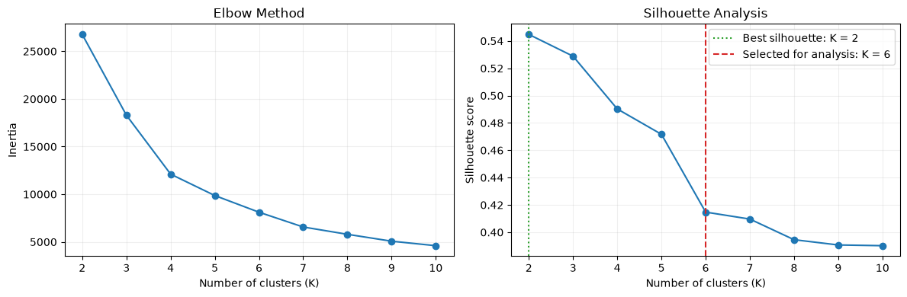
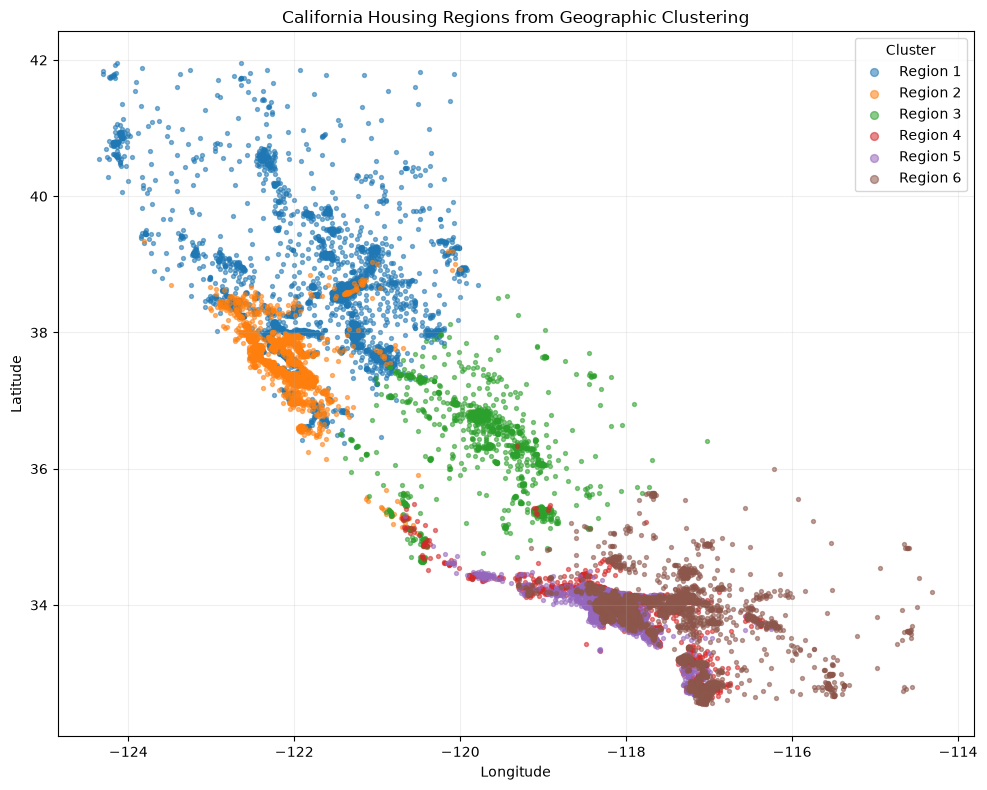
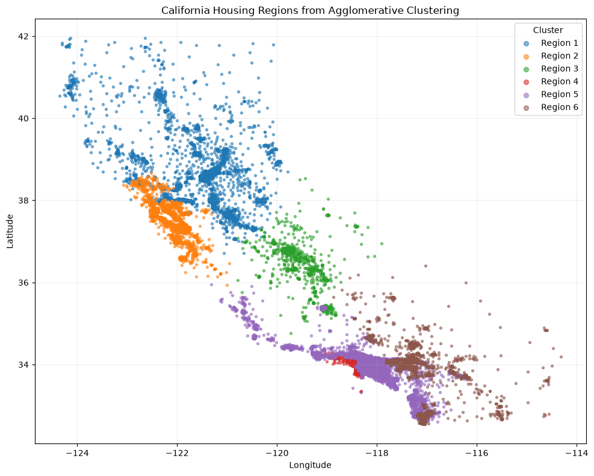
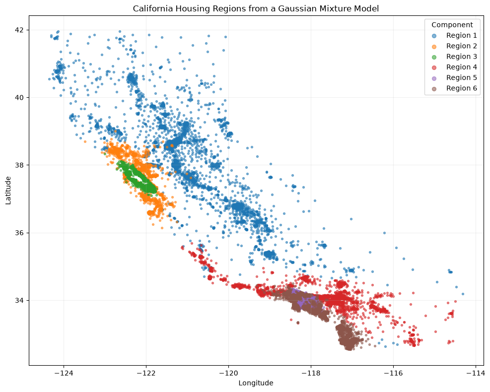

The Backpropagators

## Research goal

This analysis uses K-means clustering to divide California census block groups into a small set of housing-market regions. Unlike a supervised model, K-means does not predict a known label. Its purpose here is exploratory: it looks for block groups that are similar in both location and median house value, making broad geographic price patterns easier to see.

The source is scikit-learn's California Housing dataset, derived from the 1990 U.S. Census. Each of its 20,640 rows represents one census block group. The price variable is the block group's median house value in units of &#36;100,000, so all dollar results below describe the historical dataset—not current home prices. Some values are capped at &#36;500,001, which can also pull high-price observations together.

<div class="stat-grid" aria-label="Analysis summary">
  <div class="stat-card">
    <div class="stat-icon" aria-hidden="true">🏘️</div>
    <div class="stat-value">20,640</div>
    <div class="stat-label">census block groups</div>
  </div>
  <div class="stat-card">
    <div class="stat-icon" aria-hidden="true">📍</div>
    <div class="stat-value">3</div>
    <div class="stat-label">standardized features</div>
  </div>
  <div class="stat-card">
    <div class="stat-icon" aria-hidden="true">🗺️</div>
    <div class="stat-value">K = 6</div>
    <div class="stat-label">interpretable market regions</div>
  </div>
  <div class="stat-card">
    <div class="stat-icon" aria-hidden="true">🧭</div>
    <div class="stat-value">3</div>
    <div class="stat-label">clustering methods compared</div>
  </div>
</div>

<nav class="report-jump-grid" aria-label="Jump to a report section">
  <a class="report-jump-card" href="#methodology-k-means">
    <span class="report-jump-icon" aria-hidden="true">🧠</span>
    <span><strong>Understand K-means</strong><small>Objective, algorithm, scaling, and K selection</small></span>
  </a>
  <a class="report-jump-card" href="#results">
    <span class="report-jump-icon" aria-hidden="true">📊</span>
    <span><strong>See the results</strong><small>Notebook map, prices, and regional interpretation</small></span>
  </a>
  <a class="report-jump-card" href="#optional-clustering-comparisons">
    <span class="report-jump-icon" aria-hidden="true">🔬</span>
    <span><strong>Compare methods</strong><small>Agglomerative clustering and GMM</small></span>
  </a>
  <a class="report-jump-card" href="#appendix-full-runnable-code">
    <span class="report-jump-icon" aria-hidden="true">💻</span>
    <span><strong>View full code</strong><small>Exact cells sourced from the executed notebook</small></span>
  </a>
</nav>

## Methodology: K-means

### Data structure

The algorithm receives a numeric matrix with 20,640 rows and three columns: longitude, latitude, and median house value. A row can be written as \(x_i = (x_{i1}, x_{i2}, x_{i3})\). Longitude and latitude locate a block group, while house value introduces an economic dimension. Price is used to form the clusters; it is not included only after clustering. Consequently, the output represents **geographic price markets**, not administrative borders or strictly contiguous geographic zones.

Before fitting the model, each column is standardized by subtracting its mean and dividing by its standard deviation:

$$
z_{ij}=\frac{x_{ij}-\bar{x}_j}{\sigma_j}.
$$

### Minimization problem

For a chosen number of clusters \(K\), K-means divides the standardized observations into sets \(C_1,\ldots,C_K\). It chooses the partition and a centroid \(\mu_k\) for each set to minimize the within-cluster sum of squared Euclidean distances:

$$
\min_{C_1,\ldots,C_K,\,\mu_1,\ldots,\mu_K}
\sum_{k=1}^{K}\sum_{z_i\in C_k}\lVert z_i-\mu_k\rVert_2^2.
$$

This objective is also called inertia. A smaller value means observations lie closer to their assigned centroids, although inertia always decreases as more clusters are added and therefore cannot select \(K\) by itself.

### How the algorithm solves it

The global minimization problem is difficult to solve exactly, so K-means uses an iterative approximation. First, the k-means++ procedure selects initial centroids that are spread through the data. The assignment step sends every observation to its nearest centroid. The update step replaces each centroid with the mean of the observations currently assigned to it. Assignment and update repeat until the labels stop changing materially or the centroid movement satisfies the convergence tolerance. Because the result can depend on initialization, the full procedure is run 20 times and the solution with the smallest inertia is retained.

### Hyperparameters and selection

The main hyperparameter is \(K\), the number of clusters. Candidate values from 2 through 10 were compared using two diagnostics. The silhouette score measures whether observations are closer to their own cluster than to neighboring clusters; larger values indicate clearer separation. Inertia was inspected for an elbow, where adding another cluster begins to produce smaller improvements.

The highest silhouette score was **0.545 at \(K=2\)**. We selected **\(K=6\)** for the final analysis because two clusters hide much of the regional detail, while six produces a still-manageable set that separates several coastal, inland, northern, and southern price markets. This is a deliberate tradeoff: the six-cluster silhouette score is lower (**0.415**), so the extra detail comes with less distinct separation. The choice should not be interpreted as proof that California has exactly six natural housing regions.

The remaining settings control reproducibility and stability. `k-means++` supplies dispersed starting centers; `n_init=20` fits 20 initializations to reduce the risk of keeping a poor local solution; and `random_state=42` makes those starts repeatable. The candidate range of 2–10 and the 5,000-observation silhouette sample are evaluation choices rather than parameters of the final fitted model. Finally, arbitrary cluster IDs are relabeled north-to-south by average latitude so that Region 1 through Region 6 remain understandable and reproducible.

The model-selection curves are included as Figure 1 in the interactive figure gallery below.

### Why scaling is required

K-means is based entirely on distance. Without scaling, a feature's influence depends on its numerical range and units: a one-unit price change, a one-degree latitude change, and a one-degree longitude change would enter the calculation as if they were directly comparable. Standardization gives each feature mean zero and variance one, preventing a column from dominating merely because of its scale.

Scaling does not remove every modeling assumption. Euclidean distance still gives equal overall weight to the three standardized variables, and longitude/latitude in degrees are only an approximation to physical distance. The clusters are therefore useful summaries of this feature choice, not official geographic boundaries.

## Results

Use the tabs, arrow buttons, keyboard arrow keys, or a horizontal swipe to move through all four notebook figures. Select any image to enlarge it.

<div class="report-figure-gallery" id="housing-figure-gallery" tabindex="0" aria-label="Clustering figure gallery">
  <div class="report-gallery-tabs" role="tablist" aria-label="Choose a figure">
    <button type="button" role="tab" id="gallery-tab-1" aria-controls="gallery-panel-1" aria-selected="true" data-gallery-index="0">Model selection</button>
    <button type="button" role="tab" id="gallery-tab-2" aria-controls="gallery-panel-2" aria-selected="false" data-gallery-index="1">K-means</button>
    <button type="button" role="tab" id="gallery-tab-3" aria-controls="gallery-panel-3" aria-selected="false" data-gallery-index="2">Agglomerative</button>
    <button type="button" role="tab" id="gallery-tab-4" aria-controls="gallery-panel-4" aria-selected="false" data-gallery-index="3">GMM</button>
  </div>

  <div class="report-gallery-stage" aria-live="polite">
    <section class="report-gallery-panel is-active" id="gallery-panel-1" role="tabpanel" aria-labelledby="gallery-tab-1" data-gallery-panel="0">
      <figure id="model-selection">
        
        <figcaption><strong>Figure 1.</strong> Model-selection output. The best silhouette score occurs at K = 2; K = 6 is retained for a more detailed regional interpretation.</figcaption>
      </figure>
    </section>
    <section class="report-gallery-panel" id="gallery-panel-2" role="tabpanel" aria-labelledby="gallery-tab-2" data-gallery-panel="1" hidden>
      <figure id="kmeans-region-map">
        
        <figcaption><strong>Figure 2.</strong> Six K-means housing-market regions. Every point is a census block group; color indicates cluster membership.</figcaption>
      </figure>
    </section>
    <section class="report-gallery-panel" id="gallery-panel-3" role="tabpanel" aria-labelledby="gallery-tab-3" data-gallery-panel="2" hidden>
      <figure id="agglomerative-region-map">
        
        <figcaption><strong>Figure 3.</strong> Six spatially constrained agglomerative regions.</figcaption>
      </figure>
    </section>
    <section class="report-gallery-panel" id="gallery-panel-4" role="tabpanel" aria-labelledby="gallery-tab-4" data-gallery-panel="3" hidden>
      <figure id="gmm-region-map">
        
        <figcaption><strong>Figure 4.</strong> Six Gaussian-mixture components.</figcaption>
      </figure>
    </section>
  </div>

  <div class="report-gallery-controls">
    <button type="button" class="report-gallery-arrow" data-gallery-previous aria-label="Show previous figure">← Previous</button>
    <span class="report-gallery-status" aria-live="polite">Figure 1 of 4</span>
    <button type="button" class="report-gallery-arrow" data-gallery-next aria-label="Show next figure">Next →</button>
  </div>
  <p class="report-gallery-hint">Swipe left or right on the figure to browse.</p>
</div>

### Mean house value by region

| Region | Mean house value | Block groups | Geographic center (longitude, latitude) |
| --- | ---: | ---: | ---: |
| Region 1 | &#36;137,015 | 4,968 | −121.82, 38.40 |
| Region 2 | &#36;340,844 | 2,763 | −122.15, 37.58 |
| Region 3 | &#36;91,495 | 1,657 | −119.69, 36.25 |
| Region 4 | &#36;249,640 | 3,956 | −118.17, 33.91 |
| Region 5 | &#36;437,609 | 1,673 | −118.24, 33.90 |
| Region 6 | &#36;137,962 | 5,623 | −117.66, 33.77 |

### Interpretation

| Region | Market description | Mean value | Explanation |
| --- | --- | ---: | --- |
| Region 1 | Northern and north-central, lower-price market | &#36;137,015 | Centered near Sacramento and extending through much of northern California; it groups a broad set of less-expensive northern and interior block groups. |
| Region 2 | Bay Area and nearby coastal, high-price market | &#36;340,844 | Follows the San Francisco Bay Area and portions of the north-central coast, forming a concentrated high-value coastal market. |
| Region 3 | Central Valley, lowest-price market | &#36;91,495 | Centered in the inland Central Valley and illustrates the strongest inland–coastal price contrast in the six-region result. |
| Region 4 | Southern coastal and metropolitan, middle-to-high-price market | &#36;249,640 | Captures moderately expensive greater Los Angeles observations that are geographically close to Region 5 but lower in price. |
| Region 5 | Premium Southern California market | &#36;437,609 | Shares nearly the same geographic center as Region 4, but price separates these premium observations from nearby moderate-value block groups. |
| Region 6 | Broad southern and inland, lower-price market | &#36;137,962 | The largest cluster by row count; it spreads across southern and inland California as a lower-price counterpart to coastal metropolitan clusters. |

The clearest overall pattern is a coastal premium, especially around the Bay Area and Southern California, alongside lower average values in the Central Valley and broader inland areas. Regions 4 and 5 demonstrate why the colors should not be read as contiguous political regions: observations can occupy similar coordinates yet receive different labels because their prices differ. The analysis is descriptive, and the cluster names are interpretations based on their plotted locations and centroids rather than county or city boundaries.

## Optional clustering comparisons

To test whether the regional patterns depend strongly on K-means, we also applied agglomerative clustering and a Gaussian mixture model. Both comparisons use the same three standardized features and six groups. Cluster labels are arbitrary and are relabeled north-to-south separately for each method, so identically numbered regions across methods are not necessarily composed of the same block groups.

### Spatially constrained agglomerative clustering

Agglomerative clustering begins with individual observations and repeatedly merges the closest groups. We used Ward linkage, which chooses merges that produce the smallest increase in within-cluster variance. A 15-nearest-neighbor graph constructed from longitude and latitude restricts possible merges to geographically local observations. This constraint makes connected regional shapes more likely than under ordinary K-means while price still influences which neighboring groups are merged. Its map appears as Figure 3 in the gallery above.

| Agglomerative region | Mean house value | Block groups | Geographic center (longitude, latitude) |
| --- | ---: | ---: | ---: |
| Region 1 | &#36;126,648 | 3,823 | −121.67, 38.67 |
| Region 2 | &#36;284,349 | 4,018 | −122.15, 37.56 |
| Region 3 | &#36;81,359 | 1,266 | −119.50, 36.37 |
| Region 4 | &#36;401,164 | 1,155 | −118.43, 34.02 |
| Region 5 | &#36;222,772 | 8,205 | −118.14, 33.90 |
| Region 6 | &#36;114,417 | 2,173 | −117.12, 33.69 |

The neighbor constraint produces visibly more connected geographic bands than K-means. It retains the broad northern, Bay Area, Central Valley, and Southern California distinctions, but its cluster sizes are less balanced: Region 5 contains 8,205 block groups while Region 4 contains 1,155. Its regional mean values range from about &#36;81,000 to &#36;401,000.

### Gaussian mixture model

The Gaussian mixture model uses six Gaussian components with full covariance matrices, `n_init=10`, and `random_state=42`. Unlike K-means, it allows components to have different spreads and orientations and models membership probabilistically. The final map assigns each observation to its most likely component. Standard GMM does not impose a geographic-neighbor constraint, so it can place separated locations in the same component. Its map appears as Figure 4 in the gallery above.

| GMM region | Mean house value | Block groups | Geographic center (longitude, latitude) |
| --- | ---: | ---: | ---: |
| Region 1 | &#36;107,500 | 4,750 | −120.85, 37.93 |
| Region 2 | &#36;251,419 | 2,038 | −122.17, 37.72 |
| Region 3 | &#36;285,703 | 2,561 | −122.19, 37.60 |
| Region 4 | &#36;171,179 | 2,634 | −117.92, 34.14 |
| Region 5 | &#36;188,895 | 5,088 | −118.17, 33.98 |
| Region 6 | &#36;308,998 | 3,569 | −117.71, 33.44 |

The GMM separates overlapping price distributions in the Bay Area and Southern California, but its map also shows why probabilistic similarity is not the same as contiguity. Some components extend across broad or separated locations. It is useful for describing flexible, overlapping market distributions, but less suitable when connected map regions are the main priority.

### Comparison

K-means remains the primary method because it is required, transparent, and produces an interpretable six-region summary. Spatially constrained agglomerative clustering is the strongest alternative when contiguity matters because it only permits geographically local merges. The GMM is the most flexible representation of differently shaped feature distributions, but it offers the weakest protection against disconnected regions. Across all three methods, the maps consistently reveal broad coastal–inland and northern–southern structure, while the exact boundaries and mean values depend on the clustering assumptions.

<table class="comparison-table">
  <thead>
    <tr><th>Method</th><th>Main strength</th><th>Geographic behavior</th><th>Main tradeoff</th></tr>
  </thead>
  <tbody>
    <tr><td>K-means</td><td>Simple and transparent</td><td>Location encourages regional grouping</td><td>Does not guarantee contiguity</td></tr>
    <tr><td>Agglomerative</td><td>Locally connected merging</td><td>Strongest contiguity support</td><td>Produces uneven cluster sizes</td></tr>
    <tr><td>Gaussian mixture</td><td>Flexible probabilistic components</td><td>Can model overlapping markets</td><td>May create disconnected components</td></tr>
  </tbody>
</table>

## Appendix: full runnable code

The group's [executed `index.ipynb` analysis notebook](https://github.com/ucd-cosmos-data/26-the-backpropagators-analysis/blob/main/realestate/notebooks/index.ipynb) is the source of truth for this report. It contains the saved outputs, model-selection analysis, K-means model, optional clustering comparisons, maps, and price tables. All four figures above were exported directly from that notebook.

The complete code below is sourced from the notebook's code cells in execution order. It requires Python with pandas, matplotlib, and scikit-learn.


```python
# import dataset
import pandas as pd
from sklearn.datasets import fetch_california_housing

data = fetch_california_housing(as_frame=True)
df = data.frame

# print data
print(data.DESCR)

from sklearn.cluster import KMeans
from sklearn.metrics import silhouette_score
from sklearn.preprocessing import StandardScaler

clustering_features = df[["Longitude", "Latitude", "MedHouseVal"]]
scaled_features = StandardScaler().fit_transform(clustering_features)

candidate_clusters = range(2, 11)
selection_results = []

for candidate_k in candidate_clusters:
    candidate_model = KMeans(
        n_clusters=candidate_k, random_state=42, n_init=20
    )
    candidate_labels = candidate_model.fit_predict(scaled_features)
    selection_results.append(
        {
            "K": candidate_k,
            "Inertia": candidate_model.inertia_,
            "Silhouette Score": silhouette_score(
                scaled_features,
                candidate_labels,
                sample_size=5_000,
                random_state=42,
            ),
        }
    )

cluster_selection = pd.DataFrame(selection_results).set_index("K")
best_silhouette_k = int(cluster_selection["Silhouette Score"].idxmax())
selected_k = 6  # Chosen for geographic detail and regional interpretability.
print(f"Highest silhouette score: K = {best_silhouette_k}.")
print(f"Selected for the regional analysis: K = {selected_k}.")
cluster_selection.round({"Inertia": 0, "Silhouette Score": 3})

import matplotlib.pyplot as plt

fig, axes = plt.subplots(1, 2, figsize=(12, 4))

axes[0].plot(cluster_selection.index, cluster_selection["Inertia"], marker="o")
axes[0].set(
    title="Elbow Method",
    xlabel="Number of clusters (K)",
    ylabel="Inertia",
)

axes[1].plot(
    cluster_selection.index,
    cluster_selection["Silhouette Score"],
    marker="o",
)
axes[1].axvline(
    best_silhouette_k,
    color="tab:green",
    linestyle=":",
    label=f"Best silhouette: K = {best_silhouette_k}",
)
axes[1].axvline(
    selected_k,
    color="tab:red",
    linestyle="--",
    label=f"Selected for analysis: K = {selected_k}",
)
axes[1].set(
    title="Silhouette Analysis",
    xlabel="Number of clusters (K)",
    ylabel="Silhouette score",
)
axes[1].legend()

for ax in axes:
    ax.grid(alpha=0.2)
    ax.set_xticks(list(candidate_clusters))

fig.tight_layout()
plt.show()

# k-means clustering on the California housing dataset
kmeans = KMeans(n_clusters=selected_k, random_state=42, n_init=20)
df["cluster"] = kmeans.fit_predict(scaled_features)

# Give the arbitrary K-means labels stable, readable region numbers.
centroids = (
    df.groupby("cluster")[["Longitude", "Latitude"]]
    .mean()
    .sort_values(["Latitude", "Longitude"], ascending=[False, True])
)
region_number = {cluster: number for number, cluster in enumerate(centroids.index, start=1)}
df["Region"] = df["cluster"].map(region_number).map(lambda number: f"Region {number}")

# show clustering results on a scatter plot
fig, ax = plt.subplots(figsize=(10, 8))
for region, region_data in df.groupby("Region", sort=True):
    ax.scatter(
        region_data["Longitude"],
        region_data["Latitude"],
        s=8,
        alpha=0.55,
        label=region,
    )

ax.set(
    title="California Housing Regions from Geographic Clustering",
    xlabel="Longitude",
    ylabel="Latitude",
)
ax.legend(title="Cluster", markerscale=2, frameon=True)
ax.grid(alpha=0.2)
fig.tight_layout()
plt.show()

region_price_summary = (
    df.groupby("Region", sort=True)
    .agg(
        Mean_Price_USD=("MedHouseVal", lambda values: values.mean() * 100_000),
        Block_Groups=("MedHouseVal", "size"),
        Centroid_Longitude=("Longitude", "mean"),
        Centroid_Latitude=("Latitude", "mean"),
    )
)

region_price_summary.style.format(
    {
        "Mean_Price_USD": "${:,.0f}",
        "Block_Groups": "{:,}",
        "Centroid_Longitude": "{:.2f}",
        "Centroid_Latitude": "{:.2f}",
    }
)

from sklearn.cluster import AgglomerativeClustering
from sklearn.neighbors import kneighbors_graph

# Restrict possible merges to nearby geographic observations.
scaled_coordinates = StandardScaler().fit_transform(df[["Longitude", "Latitude"]])
geographic_connectivity = kneighbors_graph(
    scaled_coordinates, n_neighbors=15, include_self=False
)

agglomerative = AgglomerativeClustering(
    n_clusters=selected_k,
    linkage="ward",
    connectivity=geographic_connectivity,
)
df["agglomerative_cluster"] = agglomerative.fit_predict(scaled_features)

agglomerative_centroids = (
    df.groupby("agglomerative_cluster")[["Longitude", "Latitude"]]
    .mean()
    .sort_values(["Latitude", "Longitude"], ascending=[False, True])
)
agglomerative_region_number = {
    cluster: number
    for number, cluster in enumerate(agglomerative_centroids.index, start=1)
}
df["Agglomerative Region"] = (
    df["agglomerative_cluster"]
    .map(agglomerative_region_number)
    .map(lambda number: f"Region {number}")
)

fig, ax = plt.subplots(figsize=(10, 8))
for region, region_data in df.groupby("Agglomerative Region", sort=True):
    ax.scatter(
        region_data["Longitude"],
        region_data["Latitude"],
        s=8,
        alpha=0.55,
        label=region,
    )

ax.set(
    title="California Housing Regions from Agglomerative Clustering",
    xlabel="Longitude",
    ylabel="Latitude",
)
ax.legend(title="Cluster", markerscale=2, frameon=True)
ax.grid(alpha=0.2)
fig.tight_layout()
plt.show()

agglomerative_price_summary = (
    df.groupby("Agglomerative Region", sort=True)
    .agg(
        Mean_Price_USD=("MedHouseVal", lambda values: values.mean() * 100_000),
        Block_Groups=("MedHouseVal", "size"),
        Centroid_Longitude=("Longitude", "mean"),
        Centroid_Latitude=("Latitude", "mean"),
    )
)

agglomerative_price_summary.style.format(
    {
        "Mean_Price_USD": "${:,.0f}",
        "Block_Groups": "{:,}",
        "Centroid_Longitude": "{:.2f}",
        "Centroid_Latitude": "{:.2f}",
    }
)

from sklearn.mixture import GaussianMixture

gmm = GaussianMixture(
    n_components=selected_k,
    covariance_type="full",
    n_init=10,
    random_state=42,
)
df["gmm_cluster"] = gmm.fit_predict(scaled_features)

gmm_centroids = (
    df.groupby("gmm_cluster")[["Longitude", "Latitude"]]
    .mean()
    .sort_values(["Latitude", "Longitude"], ascending=[False, True])
)
gmm_region_number = {
    cluster: number for number, cluster in enumerate(gmm_centroids.index, start=1)
}
df["GMM Region"] = (
    df["gmm_cluster"]
    .map(gmm_region_number)
    .map(lambda number: f"Region {number}")
)

fig, ax = plt.subplots(figsize=(10, 8))
for region, region_data in df.groupby("GMM Region", sort=True):
    ax.scatter(
        region_data["Longitude"],
        region_data["Latitude"],
        s=8,
        alpha=0.55,
        label=region,
    )

ax.set(
    title="California Housing Regions from a Gaussian Mixture Model",
    xlabel="Longitude",
    ylabel="Latitude",
)
ax.legend(title="Component", markerscale=2, frameon=True)
ax.grid(alpha=0.2)
fig.tight_layout()
plt.show()

gmm_price_summary = (
    df.groupby("GMM Region", sort=True)
    .agg(
        Mean_Price_USD=("MedHouseVal", lambda values: values.mean() * 100_000),
        Block_Groups=("MedHouseVal", "size"),
        Centroid_Longitude=("Longitude", "mean"),
        Centroid_Latitude=("Latitude", "mean"),
    )
)

gmm_price_summary.style.format(
    {
        "Mean_Price_USD": "${:,.0f}",
        "Block_Groups": "{:,}",
        "Centroid_Longitude": "{:.2f}",
        "Centroid_Latitude": "{:.2f}",
    }
)
```

