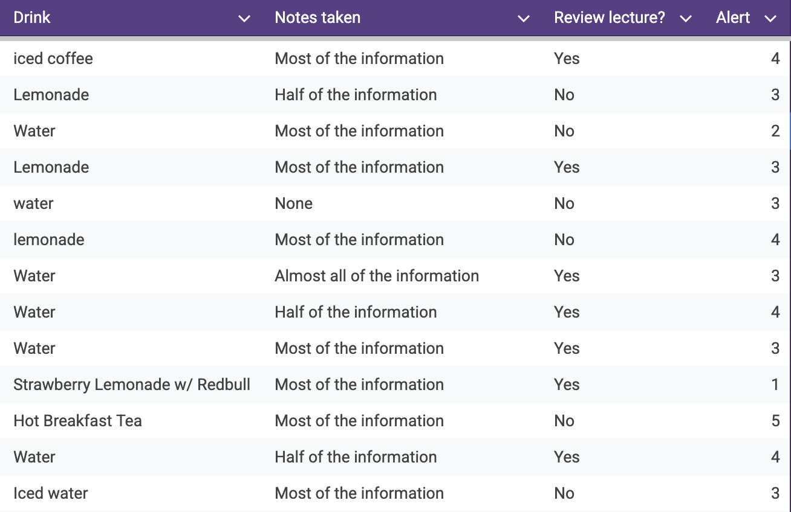
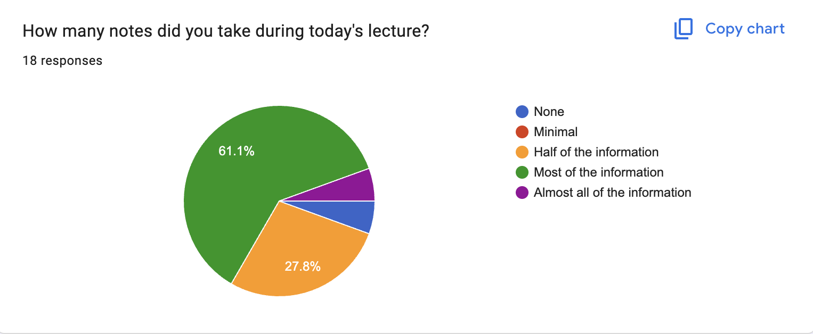
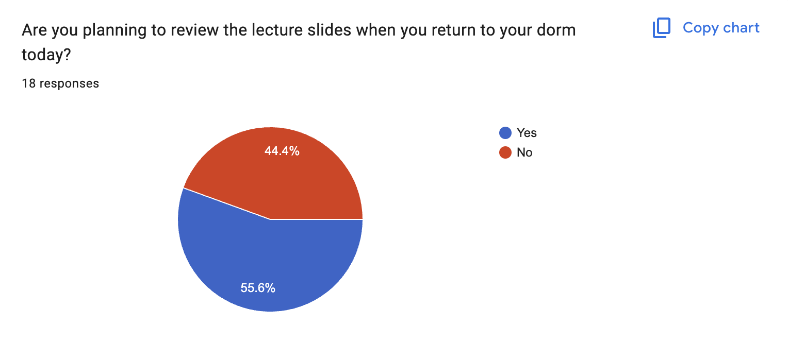
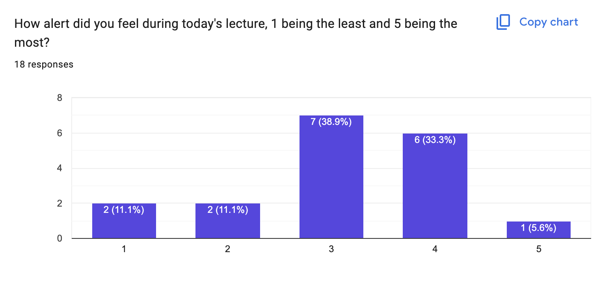

This page presents a simple classroom survey on how breakfast choices may connect with focus, note-taking, and study habits. We collected 18 responses to four short questions and used them to build a quick picture of the group's habits and energy levels.

1. What drink did you have for breakfast today?
2. How many notes did you take during the lecture?
3. Do you plan to review the lecture tonight?
4. How alert did you feel during the lecture?

## At a glance

  

    
💧

    
Water

    
most common breakfast drink

  

  

    
📝

    
61%

    
took notes on most of the lecture

  

  

    
🔁

    
55.6%

    
planned to review the lecture later

  

  

    
⚡

    
3 / 5

    
typical alertness rating

  

## Survey summary

| Topic | Main finding |
| --- | --- |
| Breakfast drinks | Water was the most common drink reported. |
| Note-taking | Most people took notes on the majority of the topics. |
| Review plans | 55.6% of people said they planned to review the lecture later. |
| Alertness | Most respondents felt somewhat alert. |

## Raw responses

<figure style="margin: 0; padding: 1rem; background: var(--entry); border: 1px solid var(--border); border-radius: var(--radius);">
  
  <figcaption style="margin-top: 0.5rem; text-align: center; color: var(--secondary); font-weight: 500;">A sample of the raw survey responses</figcaption>
</figure>

## Results by question

  <figure style="margin: 0; padding: 1rem; background: var(--entry); border: 1px solid var(--border); border-radius: var(--radius);">
    
    <figcaption style="margin-top: 0.5rem; text-align: center; color: var(--secondary); font-weight: 500;">Notes taken during lecture</figcaption>
  </figure>
  <figure style="margin: 0; padding: 1rem; background: var(--entry); border: 1px solid var(--border); border-radius: var(--radius);">
    
    <figcaption style="margin-top: 0.5rem; text-align: center; color: var(--secondary); font-weight: 500;">Plans to review the lecture</figcaption>
  </figure>
  <figure style="margin: 0; padding: 1rem; background: var(--entry); border: 1px solid var(--border); border-radius: var(--radius);">
    
    <figcaption style="margin-top: 0.5rem; text-align: center; color: var(--secondary); font-weight: 500;">Alertness during the lecture</figcaption>
  </figure>

## Quick takeaways

- People who felt more alert also tended to drink caffeinated drinks for breakfast.
- Most respondents planned to review the lecture later, which suggests strong interest in follow-up study.

> Sample size is small (18 responses from one classroom), so these are casual observations rather than statistically robust conclusions.
